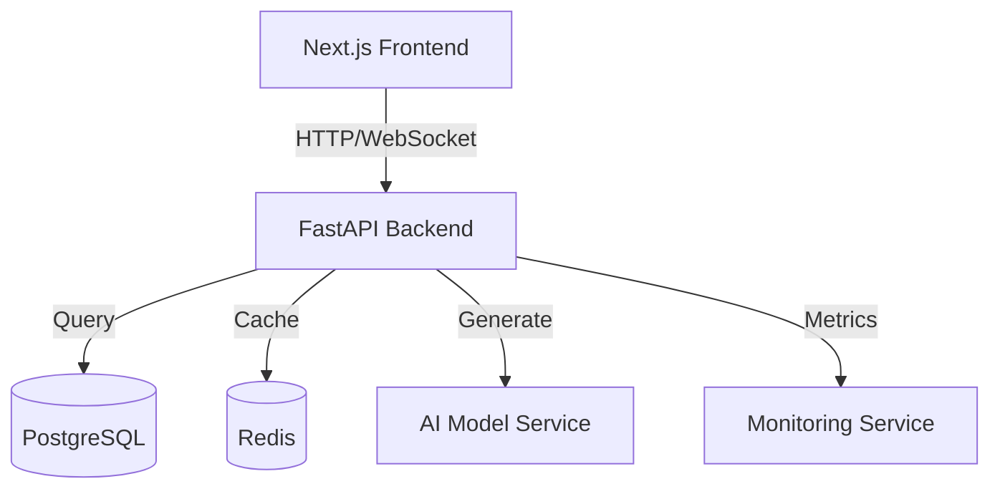

# Deployment and Integration Guide

## 1. System Architecture Overview

### Component Integration


### Service Dependencies
```yaml
services:
  frontend:
    - Next.js
    - React
    - Emotion
    - Sentry
    - PWA

  backend:
    - FastAPI
    - SQLAlchemy
    - Redis
    - Prometheus

  ai:
    - PyTorch
    - Transformers
    - CUDA
    - TensorRT
```

## 2. Deployment Process

### 1. Infrastructure Setup
```bash
# Create necessary cloud resources
terraform apply -var-file=prod.tfvars

# Configure networking
kubectl apply -f networking/

# Set up monitoring
helm install prometheus prometheus-community/kube-prometheus-stack
```

### 2. Database Migration
```bash
# Run migrations
alembic upgrade head

# Verify database
python scripts/verify_db.py
```

### 3. Model Deployment
```bash
# Download and prepare models
python scripts/prepare_models.py

# Start model service
docker-compose up -d ai-service
```

### 4. Application Deployment
```bash
# Build and push images
docker build -t codeface-frontend:latest frontend/
docker build -t codeface-backend:latest backend/

# Deploy services
kubectl apply -f k8s/
```

## 3. Environment Configuration

### Production Settings
```env
# Frontend (.env.production)
NEXT_PUBLIC_API_URL=https://api.codeface.ai
NEXT_PUBLIC_WS_URL=wss://api.codeface.ai
NEXT_PUBLIC_SENTRY_DSN=<sentry-dsn>
NEXT_PUBLIC_GA_ID=<ga-id>

# Backend (.env.production)
DATABASE_URL=postgresql://user:pass@db:5432/codeface
REDIS_URL=redis://cache:6379/0
MODEL_PATH=/path/to/model
SENTRY_DSN=<sentry-dsn>
LOG_LEVEL=INFO
```

### Security Configuration
```yaml
# security.yaml
security:
  ssl:
    enabled: true
    cert_path: /etc/ssl/certs/codeface.crt
    key_path: /etc/ssl/private/codeface.key

  cors:
    allowed_origins:
      - https://codeface.ai
    allowed_methods:
      - GET
      - POST
      - OPTIONS

  rate_limiting:
    requests_per_minute: 60
    burst: 10
```

## 4. Monitoring Setup

### Prometheus Configuration
```yaml
# prometheus.yml
global:
  scrape_interval: 15s
  evaluation_interval: 15s

scrape_configs:
  - job_name: 'codeface-backend'
    static_configs:
      - targets: ['backend:8000']

  - job_name: 'codeface-model'
    static_configs:
      - targets: ['ai-service:8001']
```

### Grafana Dashboards
```json
{
  "dashboard": {
    "panels": [
      {
        "title": "Request Rate",
        "type": "graph",
        "targets": [
          {
            "expr": "rate(http_requests_total[5m])"
          }
        ]
      },
      {
        "title": "Model Generation Time",
        "type": "graph",
        "targets": [
          {
            "expr": "rate(model_generation_seconds_sum[5m])"
          }
        ]
      }
    ]
  }
}
```

## 5. Performance Optimization

### Caching Strategy
```python
# Cache configuration
CACHE_CONFIG = {
    'default': {
        'BACKEND': 'redis_cache.RedisCache',
        'LOCATION': 'redis://cache:6379/0',
        'OPTIONS': {
            'CLIENT_CLASS': 'redis_cache.client.DefaultClient',
            'MAX_ENTRIES': 10000,
            'CULL_FREQUENCY': 3
        }
    }
}

# Cache patterns
CACHE_PATTERNS = {
    'model_response': {
        'timeout': 3600,  # 1 hour
        'key_prefix': 'model:response'
    },
    'user_session': {
        'timeout': 86400,  # 24 hours
        'key_prefix': 'user:session'
    }
}
```

### Load Balancing
```yaml
# nginx.conf
upstream backend {
    least_conn;
    server backend1:8000;
    server backend2:8000;
    server backend3:8000;
}

upstream ai_service {
    least_conn;
    server ai1:8001;
    server ai2:8001;
}
```

## 6. Backup and Recovery

### Backup Strategy
```bash
#!/bin/bash
# backup.sh

# Database backup
pg_dump -h db -U postgres codeface > backup/db_$(date +%Y%m%d).sql

# Model files backup
rsync -av /path/to/models backup/models_$(date +%Y%m%d)/

# Configuration backup
tar -czf backup/config_$(date +%Y%m%d).tar.gz /etc/codeface/
```

### Recovery Procedures
```python
# recovery.py
async def recover_system():
    # Restore database
    await restore_database()
    
    # Verify data integrity
    await verify_data()
    
    # Reload models
    await reload_models()
    
    # Verify system health
    await health_check()
```

## 7. Scaling Guidelines

### Horizontal Scaling
```yaml
# kubernetes/hpa.yaml
apiVersion: autoscaling/v2beta2
kind: HorizontalPodAutoscaler
metadata:
  name: codeface-backend
spec:
  scaleTargetRef:
    apiVersion: apps/v1
    kind: Deployment
    name: codeface-backend
  minReplicas: 3
  maxReplicas: 10
  metrics:
  - type: Resource
    resource:
      name: cpu
      target:
        type: Utilization
        averageUtilization: 70
```

### Vertical Scaling
```yaml
# kubernetes/resources.yaml
resources:
  requests:
    memory: "2Gi"
    cpu: "1"
  limits:
    memory: "4Gi"
    cpu: "2"
```

## 8. Maintenance Procedures

### Regular Maintenance
```bash
# maintenance.sh
#!/bin/bash

# Update dependencies
poetry update

# Run database maintenance
python manage.py maintenance

# Clean up old logs
find /var/log/codeface -type f -mtime +30 -delete

# Update SSL certificates
certbot renew
```

### Emergency Procedures
```python
# emergency.py
async def handle_emergency():
    # Stop incoming traffic
    await toggle_maintenance_mode(True)
    
    # Save system state
    await backup_state()
    
    # Notify team
    await send_alerts()
    
    # Execute recovery
    await execute_recovery_plan()
```

