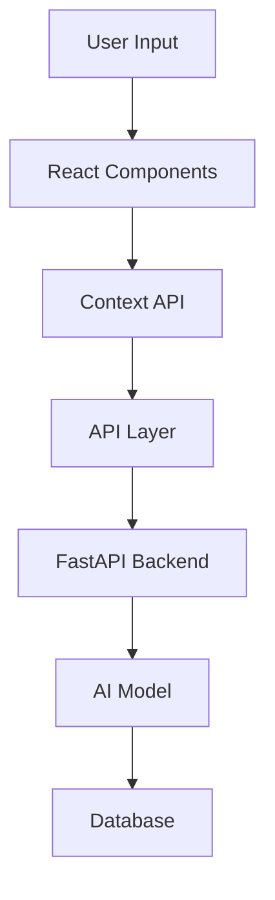

# System Architecture and Integration

## 1. Core System Overview

### Component Hierarchy
```
/src
├── pages/
│   ├── _app.tsx           # App wrapper with providers
│   ├── _document.tsx      # Custom document for SSR
│   ├── index.tsx          # Landing page
│   └── chat/
│       └── [id].tsx       # Dynamic chat route
├── components/
│   ├── layout/           # Structural components
│   ├── features/         # Business logic components
│   └── ui/              # Reusable UI components
├── hooks/               # Custom React hooks
├── context/            # Global state management
└── utils/             # Helper functions
```

### Data Flow Architecture


## 2. Integration Points

### Frontend-Backend Communication
```typescript
// utils/api.ts
interface APIConfig {
  baseURL: string;
  timeout: number;
  headers: Record<string, string>;
}

class APIClient {
  private config: APIConfig;
  
  constructor(config: APIConfig) {
    this.config = config;
  }
  
  async chat(message: string): Promise<Response> {
    // Implementation
  }
  
  async stream(conversationId: string): Promise<EventSource> {
    // Implementation
  }
}
```

### WebSocket Integration
```typescript
// utils/websocket.ts
class WSClient {
  private ws: WebSocket;
  
  constructor(url: string) {
    this.ws = new WebSocket(url);
    this.setupHandlers();
  }
  
  private setupHandlers() {
    this.ws.onmessage = (event) => {
      // Handle incoming messages
    };
  }
}
```

## 3. Core Features Implementation

### Chat System
```typescript
// features/chat/ChatSystem.tsx
interface ChatSystemProps {
  conversationId: string;
}

const ChatSystem: React.FC<ChatSystemProps> = ({ conversationId }) => {
  const { messages, sendMessage } = useChat(conversationId);
  const { streaming, startStream } = useMessageStream(conversationId);
  
  // Implementation
};
```

### AI Model Integration
```python
# backend/services/ai_service.py
from typing import AsyncGenerator

class AIService:
    def __init__(self, model_manager: ModelManager):
        self.model_manager = model_manager
        
    async def generate_response(
        self,
        message: str,
        conversation_id: str
    ) -> AsyncGenerator[str, None]:
        model = await self.model_manager.get_model()
        async for token in model.generate(message):
            yield token
```

## 4. State Management Details

### Global State Structure
```typescript
interface GlobalState {
  theme: Theme;
  user: User | null;
  conversations: Conversation[];
  activeConversation: string | null;
  settings: AppSettings;
}

interface AppSettings {
  modelConfig: {
    temperature: number;
    maxTokens: number;
    topP: number;
  };
  interface: {
    fontSize: number;
    fontFamily: string;
    codeTheme: string;
  };
}
```

### State Updates Pattern
```typescript
type Action = 
  | { type: 'SET_THEME'; payload: Theme }
  | { type: 'ADD_MESSAGE'; payload: Message }
  | { type: 'UPDATE_SETTINGS'; payload: Partial<AppSettings> };

function reducer(state: GlobalState, action: Action): GlobalState {
  switch (action.type) {
    // Implementation
  }
}
```

## 5. Security Implementation

### Authentication Flow
```typescript
// utils/auth.ts
interface AuthConfig {
  tokenRefreshInterval: number;
  sessionTimeout: number;
}

class AuthManager {
  private config: AuthConfig;
  
  constructor(config: AuthConfig) {
    this.config = config;
    this.setupRefreshTimer();
  }
  
  private setupRefreshTimer() {
    setInterval(() => {
      this.refreshToken();
    }, this.config.tokenRefreshInterval);
  }
}
```

### API Security
```python
# backend/middleware/security.py
from fastapi import Security
from fastapi.security import HTTPBearer

security = HTTPBearer()

async def verify_token(token: str = Security(security)):
    # Token verification logic
    pass
```

## 6. Performance Optimizations

### Code Splitting Strategy
```typescript
// pages/chat/[id].tsx
const CodeBlock = dynamic(() => import('@/components/CodeBlock'), {
  loading: () => <CodeBlockSkeleton />
});

const ChatInterface = dynamic(() => import('@/components/ChatInterface'), {
  ssr: false
});
```

### Caching Implementation
```typescript
// utils/cache.ts
class CacheManager {
  private cache: Map<string, any>;
  private maxAge: number;
  
  constructor(maxAge: number) {
    this.cache = new Map();
    this.maxAge = maxAge;
  }
  
  set(key: string, value: any): void {
    this.cache.set(key, {
      value,
      timestamp: Date.now()
    });
  }
}
```

## 7. Monitoring and Analytics

### Performance Monitoring
```typescript
// utils/monitoring.ts
interface PerformanceMetrics {
  responseTime: number;
  memoryUsage: number;
  fps: number;
}

class PerformanceMonitor {
  private metrics: PerformanceMetrics[];
  
  track(metric: keyof PerformanceMetrics, value: number): void {
    // Implementation
  }
}
```

### Error Tracking
```typescript
// utils/error-tracking.ts
interface ErrorReport {
  message: string;
  stack?: string;
  metadata: Record<string, any>;
}

class ErrorTracker {
  report(error: Error, metadata?: Record<string, any>): void {
    // Implementation
  }
}
```

## 8. Mobile Optimization

### Responsive Design System
```typescript
// styles/breakpoints.ts
export const breakpoints = {
  mobile: 480,
  tablet: 768,
  desktop: 1024,
  wide: 1280
};

export const mediaQueries = {
  mobile: `@media (max-width: ${breakpoints.mobile}px)`,
  tablet: `@media (max-width: ${breakpoints.tablet}px)`,
  desktop: `@media (max-width: ${breakpoints.desktop}px)`,
  wide: `@media (min-width: ${breakpoints.wide}px)`
};
```

### Touch Interactions
```typescript
// hooks/useTouch.ts
interface TouchHandlers {
  onSwipe: (direction: 'left' | 'right') => void;
  onPinch: (scale: number) => void;
}

function useTouch(handlers: TouchHandlers) {
  // Implementation
}
```

